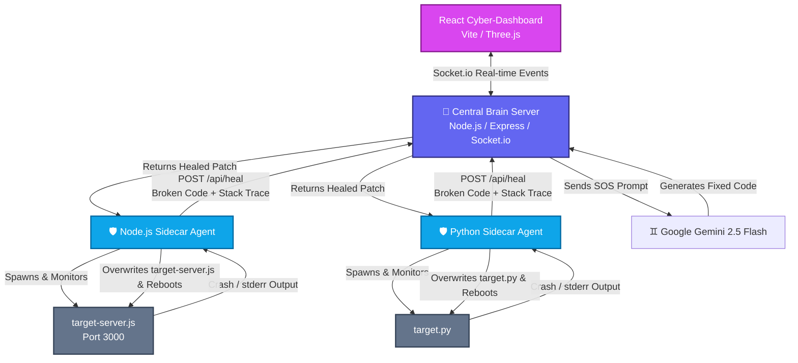

# 🛡️ Project Aegis: Autonomous Self-Healing Grid

> [!NOTE]
> **System Architect:** Vineet M Dharwad  
> **Core Directive:** Autonomous Grid Remediation  
> **Trademark & Copyright:** Engineered by Vineet M Dharwad

An AI-powered, real-time self-healing application grid. Aegis implements the **sidecar pattern** using lightweight agents (Node.js & Python) to monitor target services, intercept crashes, request automated patches from a central AI "Brain" powered by **Gemini**, and dynamically hot-swap & resurrect failed services. 

All real-time telemetry, crash reports, and neural healing sequences are visualized through a stunning, futuristic 3D cyberpunk dashboard.

---

## 🏗️ Architecture Overview

Project Aegis consists of four core components working together in a closed-loop feedback system:



### 1. 🧠 Aegis Central Brain (`/aegis-central-brain`)
The orchestrator of the grid. It is an Express server that:
- Exposes a universal `/api/heal` endpoint.
- Integrates with the **Google Gemini API** (`gemini-2.5-flash`) to analyze stack traces/error logs against source code and compile clean, executable patches.
- Operates a **Socket.io** server broadcasting telemetry events to the dashboard.

### 2. 📺 The War Room Dashboard (`/aegis-dashboard`)
A 3D dashboard displaying live telemetry. It features:
- A spinning **3D WebGL Server Core** (React Three Fiber / `@react-three/drei`) that mutates dynamically based on the state of the network (`HEALTHY` (cyan), `CRASHED` (red), `HEALING` (purple)).
- A real-time terminal window outputting live network status and AI repair details broadcast via WebSockets.

### 3. 🛡️ Node.js Sidecar Agent (`/aegis-node-agent`)
A protective bubble running alongside a Node.js microservice (`target-server.js`). It:
- Spawns the target process and listens to its standard error (`stderr`) stream.
- Intercepts crashes, extracts the source code, sends the payload to the Central Brain, overwrites the target file with the returned patch, and hot-boots the service.

### 4. 🛡️ Python Sidecar Agent (`/aegis-python-agent`)
A Python implementation (`agent.py`) that performs identical self-healing tasks for a target Python script (`target.py`), intercepting tracebacks and resolving errors in real-time.

---

## ⚡ How the Healing Sequence Works

1. **Failure Trigger**: The target server runs into a fatal error (e.g., a non-existent function call or division by zero).
2. **Interception**: The Sidecar Agent detects the crash on `stderr`, terminates the dead process, and reads the broken file.
3. **Telemetry & SOS Broadcast**: The agent sends an HTTP payload to the Central Brain. The Brain instantly alerts the React Dashboard, turning the 3D core **Red (CRASHED)**.
4. **AI Diagnosis**: The Brain uplinks to Gemini, sending the broken code and error logs. The dashboard changes to **Purple (HEALING)**.
5. **Patch & Resurrection**: Gemini generates the patch. The Brain returns it to the agent, which performs a hot-swap write to the file. The dashboard turns **Cyan (HEALTHY)** as the agent reboots the service.

---

## ⚙️ Technologies Used

- **Backend / APIs**: Node.js, Express, Socket.io, `child_process` spawning.
- **Artificial Intelligence**: Google Generative AI SDK (`gemini-2.5-flash`).
- **Frontend / 3D Graphics**: React, Vite, Three.js, React Three Fiber (R3F), Framer Motion, Tailwind CSS, Lucide React.
- **Python Stack**: Python 3, `subprocess`, `requests`.

---

## 🚀 Getting Started

Follow these steps to spin up the entire Aegis Autonomous Grid locally.

### Prerequisites
- [Node.js](https://nodejs.org/) (v18+ recommended)
- [Python 3](https://www.python.org/)
- A **Google Gemini API Key** (Get one from [Google AI Studio](https://aistudio.google.com/))

---

### Step-by-Step Setup

#### 1. Configure the Central Brain
Go into the `aegis-central-brain` directory, copy the environment template, and install dependencies:
```bash
cd aegis-central-brain
cp .env.example .env
npm install
```
Edit your `.env` file and insert your API key:
```env
GEMINI_API_KEY=your_actual_gemini_api_key
```

Now, boot up the Central Brain:
```bash
node brain-server.js
```
*The server will start listening for telemetry and sidecar signals on **Port 8081**.*

---

#### 2. Run the Cyber-Dashboard
Open a new terminal window, navigate to `aegis-dashboard`, install the UI dependencies, and launch Vite:
```bash
cd aegis-dashboard
npm install
npm run dev
```
*Open the provided local URL (usually `http://localhost:5173`) in your browser to view the 3D dashboard. It will show a rotating blue sphere representing a healthy grid state.*

---

#### 3. Run the Node.js Sidecar Agent
Open a new terminal window, navigate to `aegis-node-agent`, install its dependencies, and start the agent:
```bash
cd aegis-node-agent
npm install
node agent.js
```
The sidecar will start the target web server on **Port 3000**.
- **Trigger the Crash**: Visit `http://localhost:3000` in your browser. Refresh it.
- On the **3rd request**, the server triggers a simulated fatal error.
- Watch your terminal and the 3D Dashboard: the core will turn **red**, transition to **purple** as Gemini fixes the code, and return to **cyan** as the server is resurrected!
- Refresh the browser at `http://localhost:3000` again. The server will run perfectly, as the bug has been permanently patched in `target-server.js`!

---

#### 4. Run the Python Sidecar Agent
Open a new terminal window, navigate to `aegis-python-agent`, and setup python dependencies:
```bash
cd aegis-python-agent

# Install the requests library (or activate your virtual env if using one)
pip install requests
```

If you want to simulate a crash, open `target.py` and add a crash trigger (such as `x = 1 / 0` on the third loop), then run the agent:
```bash
python agent.py
```
- The agent will launch the python loop. 
- Once it encounters a crash, it will transmit the traceback to the Central Brain, fetch a patch from Gemini, overwrite `target.py`, and automatically reboot the Python script.

---

## 🛡️ License

This project is licensed under the MIT License - see the [LICENSE](LICENSE) file for details.

Copyright (c) 2026 Vineet M Dharwad. All rights reserved.
